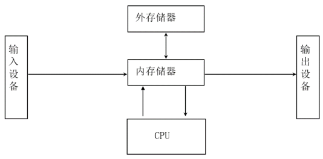

# 第1章

## 本章主要内容
### 一、计算机系统
- 计算机系统由硬件、软件组成；
- 指令系统是硬件和软件的界面。

### 二、计算机语言和程序设计方法
- 计算机语言
  - 程序员与计算机沟通的语言；
  - 描述解决问题的方法和相关数据。
- 计算机语言的级别
  - 二进制代码构成的机器语言；
  - 使用助记符的汇编语言；
  - 使用类似英语单词和语句的高级语言；
  - C++是面向对象的高级语言
- C++支持的程序设计方法
  - 面向过程的程序设计方法；
  - 面向对象的程序设计方法；
  - 泛型程序设计方法。

### 三、C++程序的开发过程
- 算法设计
- 源程序编辑
- 编译
- 连接
- 运行调试

### 四、信息在计算机中的表示与存储
- 计算机中的数据用二进制表示；
- 逻辑数据、字符数据用二进制编码表示。

### 学习建议
- 看教学视频；
- 做练习题；
- 完成“实验一”


## 计算机系统基本概念
### 计算机硬件


### 计算程序语言
- 计算机解决问题是程序控制的；
- 程序就是操作步骤；
- 程序要使用语言来表达。

### 机器语言
- 计算机能识别的是机器语言；
- 机器语言指令是由0和1编码的；
- 例如：
加法指令可能是“0001”。

### 计算机指令系统
- 机器硬件能够识别的语言（机器语言）的集合；
- 它是软件和硬件的主要界面。

### 计算机软件
- 是一系列按照特定顺序组织的计算机数据和指令的集合。一般来讲软件被划分为系统软件、应用软件和介于这两者之间的中间件；
- 软件包括程序和文档。

### 计算机程序
- 指令的序列；
- 描述解决问题的方法和数据。


## 计算机语言和程序设计方法
### 最初的计算机语言——机器语言
- 由二进制代码构成
- 计算机硬件可以识别
- 可以表示简单的操作
- 例如：加法、减法、数据移动等等

### 汇编语言
- 将机器指令映射为助记符
  - 如ADD、SUB、mov等；
- 抽象层次低，需要考虑机器细节。

### 高级语言
- 关键字、语句容易理解；
- 有含义的数据命名和算式；
- 抽象层次较高；
  - 例如，算式：```a+b+c/d```
- 屏蔽了机器的细节；
  - 例如，这样显示计算结果：```cout<<a+b+c/d```

### C++语言
- 是高级语言
- 支持面向对象的观点和方法
  - 将客观事物看做对象
  - 对象间通过消息传送进行沟通
  - 支持分类和抽象

### 面向过程的程序设计方法：
- 机器语言、汇编语言、高级语言都支持；
- 最初的目的：用于数学计算；
- 主要工作：设计求解问题的过程。
- 大型复杂的软件难以用面向过程的方式编写

### 面向对象的程序设计方法：
- 由面向对象的高级语言支持；
- 一个系统由对象构成；
- 对象之间通过消息进行通信。


## 面向对象的基本概念
### 对象
- 一般意义上的对象：现实世界中实际存在的事物。
- 面向对象方法中的对象：程序中用来描述客观事物的实体。

### 抽象与分类
- 分类依据的原则——抽象；
- 抽象出同一类对象的共同属性和行为形成类；
- 类与对象是类型与实例的关系。

### 封装
- 隐蔽对象的内部细节；
- 对外形成一个边界；
- 只保留有限的对外接口；
- 使用方便、安全性好。

### 继承
- 意义在于软件复用；
- 改造、扩展已有类形成新的类。

### 多态
- 同样的消息作用在不同对象上，可以引起不同的行为。


## 程序的开发过程
### 程序
- 源程序：
  - 用源语言写的，有待翻译的程序；
- 目标程序：
  - 源程序通过翻译程序加工以后生成的机器语言程序；
- 可执行程序：
  - 连接目标程序以及库中的某些文件，生成的一个可执行文件；
  - 例如：Windows系统平台上的.EXE文件。

### 三种不同类型的翻译程序
- 汇编程序：
  - 将汇编语言源程序翻译成目标程序；
- 编译程序：
  - 将高级语言源程序翻译成目标程序；
- 解释程序：
  - 将高级语言源程序翻译成机器指令，边翻译边执行。

### C++程序的开发过程
- 算法与数据结构设计；
- 源程序编辑；
- 编译；
- 连接；
- 测试；
- 调试。


## 计算机中的信息与存储单位
### 计算机的基本功能
- 算术运算；
- 逻辑运算。

### 计算机中信息：
- 控制信息——指挥计算机操作；
- 数据信息——计算机程序加工的对象。


### 信息的存储单位
- 位(bit，b)：数据的最小单位，表示一位二进制信息；
- 字节(byte，B)：八位二进制数字组成(1 byte = 8 bit)；
- 千字节    1 KB = 1024 B；
- 兆字节    1 MB = 1024 K；
- 吉字节    1 GB = 1024 M。


## 计算机的数字系统
### 计算机的数字系统
- 二进制系统；
- 基本符号：0、1。

### 程序中常用的数制：


### R 进制转换为十进制：
- 各位数字与它的权相乘，其积相加，例如:
(11111111.11)2=1×27+1×26+1×25+1×24+1×23+1×22+1×21+1×20+1×2-1+1×2-2 =(255.75)10

### 十进制整数转换为R 进制整数：
- “除以R取余”法。


所以 


### 十进制小数→ R 进制小数：
- “乘 以R 取整”法。


所以 


### 二、八、十六进制的相互转换
- 1位八进制数相当于3位二进制数；
- 1位十六进制数相当于4位二进制数，例如：


## 数据在计算机中的编码表示
### 二进制数的编码表示
- 需要解决的问题：负数如何表示？
- 最容易想到的方案：
0：表示“+”号；
1：表示“-”号。
- 原码
  - "符号──绝对值"表示的编码

    例如：

    
    

  - 原码的缺点：
    - 零的表示不惟一


    - 进行四则运算时，符号位须单独处理，运算规则复杂。
- 补码
  - 符号位可作为数值参加运算；
  - 减法运算可转换为加法运算；
  - 0的表示唯一。
- 补码的原理
  - 模数：
n位二进制整数的模数为  ；
n位二进制小数的模数为 2。
  - 补数：
    - 一个数减去另一个数（加一个负数），等于第一个数加第二个数的补数，例（时钟指针）： 8+(-2)=8+10 ( mod  12 )=6；
    - 一个二进制负数可用其模数与真值做加法 (模减去该数的绝对值) 求得其补码，例（时钟指针）：-2+12=10。
- 补码的计算
  - 借助于“反码”作为中间码；
  - 负数的反码与原码有如下关系：
符号位不变(仍用1表示)，其余各位取反(0变1，1变0)，例如：


  - 正数的反码与原码表示相同，正数的补码与原码相同；
  - 反码只是求补码时的中间码；
  - 负数的补码由该数反码的末位加 1 求得。
  - 对补码再求补即得到原码。
- 补码的优点：
  - 0的表示唯一；
  - 符号位可作为数值参加运算；
  - 补码运算的结果仍为补码。

### 实数的浮点表示
- 计算机中通常采用浮点方式表示小数；
- 实数 N 用浮点形式可表示为：
E：2的幂，N：阶码；
M：N的尾数。

### 字符在计算机中的表示
- 字符在计算机中是通过编码表示的；
- 例如：
ASCII码是一种常用的西文字符编码：用7位二进制数表示一个字符，最多可以表示个字符；
- 《GB 18030-2005 信息技术 中文编码字符集》是中国国家标准。


